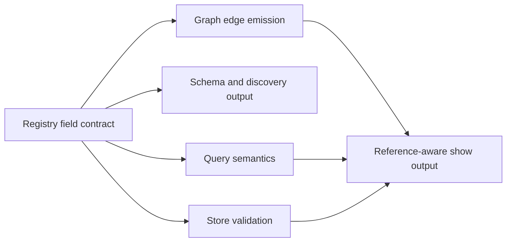

# refactor: Normalize company-context frontmatter and reference browsing

## Overview

WorkGraph already stores company-context primitives such as `org`, `team`, `person`, `agent`, `client`, and `project`, and agents can create and read them today. The missing piece is semantic closure: the frontmatter contract is uneven across types, metadata browsing is shallow, and person/company references are only partially visible through the graph and CLI.

This plan tightens the company-context contract around one source of truth: registry-defined frontmatter fields that drive validation, graph edge emission, query behavior, and browsing output. The result should let agents create and read people cleanly, inspect where a person or project is referenced, and author wiki-linked markdown without turning WorkGraph into a fuzzy metadata bucket.

## Problem Frame

The current implementation proves the storage model, but not yet the full company-context workflow:

- `person` records can be created and read, but the actor-specific UX is narrower than the underlying `Person` model.
- frontmatter accepts arbitrary extra fields, so "valid markdown" is broader than "clean company-context contract".
- `workgraph query` only matches scalar equality, so tags, team membership, and other repeated metadata are not usefully browsable.
- the graph extracts wiki-links from body/frontmatter strings, but many company-context fields do not emit typed edges.
- `show` output for company-context primitives is generic, so users cannot easily answer "where is this person referenced?" or "how is this project connected?"

This leaves agents with partial company context rather than a coherent browseable graph. The plan should improve that without violating the repo's invariants: typed graph first, CLI-first, and docs/code sync.

## Requirements Trace

- R1. Agents can create and read `person`, `team`, `org`, `client`, and `project` primitives through clean, schema-aligned CLI surfaces.
- R2. Agents can inspect where a person or other company-context primitive is referenced, distinguishing typed references from loose wiki-links.
- R3. Company-context frontmatter is canonical, discoverable through `workgraph schema`, and validated in a clean, predictable way.
- R4. Metadata browsing supports common company-context questions such as team membership, tags, ownership, and linked entities.
- R5. Wiki-link authoring remains supported, but structured fields stay the stronger source of truth and preserve provenance.
- R6. The implementation preserves CLI-first architecture, crate layering, and same-turn docs/code semantic updates.
- R7. Existing markdown should remain readable; compatibility breaks should be introduced only with explicit migration and clear fix guidance.

## Scope Boundaries

- Do not turn WorkGraph into a generic full-text search engine or generic memory database.
- Do not introduce a generic arbitrary query language in this pass.
- Do not add hosted-only capabilities that do not exist in the CLI.
- Do not model every runtime/session/subagent as a tracked actor; preserve current `person` vs `agent` rules.

### Deferred to Separate Tasks

- Generic update/merge flows for duplicate company-context primitives.
- Rich alias/rename migration flows for historical wiki-links beyond the compatibility support in this pass.
- Hosted/MCP-specific affordances beyond parity with the CLI contracts introduced here.

## Context & Research

### Relevant Code and Patterns

- `crates/wg-types/src/registry.rs` defines the built-in registry and current field contracts for company-context types.
- `crates/wg-types/src/tier_two.rs` defines richer Rust models for `Org`, `Team`, `Person`, `Agent`, `Client`, and `Project`.
- `crates/wg-store/src/document.rs` and `crates/wg-store/src/validate.rs` define the generic frontmatter model and current validation rules.
- `crates/wg-store/src/query.rs` contains the current scalar-only query behavior.
- `crates/wg-graph/src/build.rs` extracts wiki-links and emits the current structured graph edges.
- `crates/wg-cli/src/commands/actor.rs`, `crates/wg-cli/src/commands/create.rs`, and `crates/wg-cli/src/output/human.rs` define authoring and browsing UX for people and generic primitives.
- `crates/wg-cli/src/services/discovery.rs` and `crates/wg-cli/src/commands/schema.rs` define the machine-readable discovery surface that agents should trust.
- `docs/context-graph.md`, `docs/foundation.md`, and `docs/operating-model.md` define the semantic constraints this work must preserve.

### Institutional Learnings

- WorkGraph treats company context as typed first-class primitives, not a loose notes layer (`docs/context-graph.md`, `docs/foundation.md`).
- Wiki-links are explicitly secondary to structured semantics; graph provenance must distinguish them (`docs/context-graph.md`, `AGENTS.md`).
- The registry and CLI schema are the machine-readable contract; frontmatter fields should not exist only as undocumented extras (`AGENTS.md`, `crates/wg-cli/src/services/discovery.rs`).
- `person` and `agent` are durable accountability boundaries and must stay distinct from tool/runtime metadata (`docs/foundation.md`, `docs/operating-model.md`).

### External References

- None required. The repo already contains the relevant architectural constraints and patterns for this planning pass.

## Key Technical Decisions

- **Decision: Make company-context behavior registry-driven rather than hardcoding new special cases in each subsystem.**  
  `FieldDefinition` should carry enough metadata for validation, query semantics, and graph reference emission so `wg-store`, `wg-graph`, `wg-cli`, and discovery all consume the same contract.

- **Decision: Reconcile built-in registry fields with tier-two company-context structs before expanding UX.**  
  `Org`, `Team`, `Person`, `Client`, and `Project` already declare richer fields than the registry exposes. That drift should be closed first so schema, validation, and display stay aligned.

- **Decision: Prefer explicit typed references in new structured relationships and generated link output.**  
  New structured reference flows should normalize toward explicit target typing, while read compatibility remains tolerant of existing bare-id wiki-links when they resolve uniquely.

- **Decision: Add person/company reference browsing to `show` first rather than inventing a separate browsing surface immediately.**  
  The graph already has neighbor primitives internally. Surfacing inbound and outbound references inside `workgraph show <type>/<id>` gives a CLI-first navigation loop without introducing a second partially overlapping command too early.

- **Decision: Extend query behavior narrowly for repeated metadata instead of inventing a generic query DSL.**  
  Support exact matching for scalar fields and containment matching for repeated registry fields so agents can answer common browse questions without a large query language redesign.

- **Decision: Use a warning-first posture for frontmatter cleanliness where backward compatibility is at risk.**  
  The plan should make registry/schema authoritative, but avoid instantly breaking older markdown with permissive extras; status/show/schema should first surface repair guidance before stricter enforcement on write paths.

## Open Questions

### Resolved During Planning

- **What should be the canonical reference format for company-context navigation?**  
  Use explicit typed references in generated output and new structured reference contracts; retain read compatibility for unique bare-id wiki-links.

- **Where should backlink browsing live first?**  
  Extend `workgraph show` with structured inbound and outbound references, including edge kind and provenance, before adding a dedicated graph navigation command.

- **Should this work add a generic query language?**  
  No. Add only the minimum query semantics required for company-context browsing: scalar equality, repeated-field containment, and field-existence support where needed.

### Deferred to Implementation

- **Exact metadata shape for `external_refs` and `snapshot` in CLI authoring flows.**  
  The registry/discovery contract should be defined in this pass, but the final ergonomic input format may need to be tuned once the CLI parsing code is in hand.

- **Whether unknown frontmatter fields become hard write errors immediately or after a compatibility window.**  
  The implementation should decide based on blast radius after the schema audit is complete.

- **Whether orphan company-context nodes need role-aware status treatment.**  
  The implementation should confirm whether seed `org`/`team`/`person` nodes should count as normal scaffolding or hygiene issues in current status output.

## High-Level Technical Design

> *This illustrates the intended approach and is directional guidance for review, not implementation specification. The implementing agent should treat it as context, not code to reproduce.*

The core shape is to stop teaching each subsystem about company-context metadata independently. Instead:

1. the registry defines canonical company-context fields and which ones are references or repeated metadata,
2. store validation uses that contract,
3. query uses that contract for scalar vs repeated matching,
4. graph build uses that contract to emit company-context edges with provenance,
5. `show` and discovery render those same semantics back to humans and agents.

## Implementation Units

- [ ] **Unit 1: Reconcile the company-context contract across docs, tier-two models, and built-in registry fields**

**Goal:** Establish one canonical frontmatter contract for `org`, `team`, `person`, `client`, and `project` so the system no longer advertises a smaller schema than the type layer actually expects.

**Requirements:** R1, R3, R5, R6

**Dependencies:** None

**Files:**
- Modify: `docs/foundation.md`
- Modify: `docs/context-graph.md`
- Modify: `docs/operating-model.md`
- Modify: `crates/wg-types/src/registry.rs`
- Modify: `crates/wg-types/src/tier_two.rs`
- Test: `crates/wg-types/src/tier_two.rs`
- Test: `crates/wg-types/src/registry.rs`

**Approach:**
- Expand the built-in registry for company-context primitives to match the fields already present in the tier-two models where those fields are intended to be durable frontmatter.
- Tighten naming for reference-bearing fields where current names obscure the target type.
- Update canonical docs in the same turn so field meanings, actor semantics, and graph expectations stay aligned.

**Patterns to follow:**
- `crates/wg-types/src/registry.rs` built-in type definitions
- `crates/wg-types/src/tier_two.rs` roundtrip tests
- `AGENTS.md` canonical docs sync requirement

**Test scenarios:**
- Happy path — updated built-in registry exposes the same durable company-context fields the tier-two structs expect.
- Happy path — company-context structs continue to roundtrip cleanly through serialization after the field reconciliation.
- Edge case — optional metadata fields remain omitted from serialized output when empty.
- Error path — duplicate or conflicting field definitions remain rejected by registry construction tests.

**Verification:**
- `workgraph schema` can describe the complete intended company-context frontmatter surface without drift against the type layer.

- [ ] **Unit 2: Add registry-driven field semantics for clean validation and discovery**

**Goal:** Teach the registry enough about field semantics that validation and discovery can distinguish plain metadata from repeated values and typed references.

**Requirements:** R1, R3, R4, R6, R7

**Dependencies:** Unit 1

**Files:**
- Modify: `crates/wg-types/src/registry.rs`
- Modify: `crates/wg-store/src/validate.rs`
- Modify: `crates/wg-cli/src/services/discovery.rs`
- Modify: `crates/wg-cli/src/commands/schema.rs`
- Modify: `crates/wg-cli/src/output/mod.rs`
- Test: `crates/wg-store/src/validate.rs`
- Test: `crates/wg-cli/src/services/discovery.rs`

**Approach:**
- Extend field definitions with metadata needed by downstream consumers, such as reference target type, repeated/query behavior, and whether the field should participate in graph reference emission.
- Keep the validation posture compatibility-aware: reject structurally invalid reserved-field misuse now, but surface unknown or legacy company-context fields in a way that supports repair rather than silent drift.
- Ensure `workgraph schema` and `workgraph capabilities` expose these semantics so entering agents can author company-context primitives cleanly.

**Patterns to follow:**
- `crates/wg-store/src/validate.rs` registry-driven required-field validation
- `crates/wg-cli/src/services/discovery.rs` schema export patterns

**Test scenarios:**
- Happy path — schema output includes company-context field semantics needed by an agent to author valid frontmatter.
- Happy path — validation accepts known repeated/reference company-context fields in the intended shape.
- Edge case — empty optional repeated fields do not trigger false validation failures.
- Error path — unknown reserved-field collisions still fail with actionable validation errors.
- Error path — malformed reference-bearing fields surface deterministic validation or warning output rather than silently degrading.

**Verification:**
- Agents can inspect `workgraph schema` and understand not only field names but also which company-context fields are repeated or reference-bearing.

- [ ] **Unit 3: Make company-context relationships first-class graph edges**

**Goal:** Ensure people, teams, orgs, clients, and projects participate in the typed graph through structured field-derived edges rather than only soft wiki-links.

**Requirements:** R2, R4, R5, R6, R7

**Dependencies:** Unit 2

**Files:**
- Modify: `crates/wg-graph/src/build.rs`
- Modify: `crates/wg-graph/src/model.rs`
- Modify: `docs/context-graph.md`
- Test: `crates/wg-graph/src/build.rs`
- Test: `crates/wg-graph/src/model.rs`

**Approach:**
- Move company-context edge emission away from the current hardcoded omission model and toward registry-driven field processing.
- Emit structured edges for company-context fields such as organization membership, team membership, client/project links, and accountable owners where the contract identifies a durable target type.
- Preserve provenance so inbound references can distinguish field-derived facts from wiki-link mentions.

**Technical design:** *(optional -- directional guidance only)*
- Interpret registry-declared reference fields during graph build.
- Resolve targets using explicit type expectations when available to reduce bare-id ambiguity.
- Record broken references with the same hygiene model already used for other structured links.

**Patterns to follow:**
- `crates/wg-graph/src/build.rs` current structured edge emission and broken-link tracking
- `docs/context-graph.md` provenance rules

**Test scenarios:**
- Happy path — a `person` linked to a `team` through structured metadata produces a typed graph edge.
- Happy path — a `project` linked to a `client` and teams produces graph edges with field provenance.
- Edge case — repeated membership fields emit one edge per valid target without duplicates.
- Error path — missing referenced primitives appear as broken structured links with the correct provenance.
- Error path — ambiguous bare-id references remain visible as ambiguity errors instead of silently binding to the wrong node.

**Verification:**
- Graph-derived navigation can answer company-context relationship questions without relying solely on body text wiki-links.

- [ ] **Unit 4: Extend metadata query semantics for company-context browsing**

**Goal:** Let agents browse company-context metadata with useful filters instead of scalar-only exact matches.

**Requirements:** R1, R2, R4, R7

**Dependencies:** Unit 2

**Files:**
- Modify: `crates/wg-store/src/document.rs`
- Modify: `crates/wg-store/src/query.rs`
- Modify: `crates/wg-cli/src/commands/query.rs`
- Modify: `crates/wg-cli/src/output/mod.rs`
- Modify: `crates/wg-cli/src/output/human.rs`
- Test: `crates/wg-store/src/query.rs`
- Test: `crates/wg-cli/src/lib.rs`

**Approach:**
- Preserve the current simple filter surface, but teach it repeated-field containment where the registry marks a field as repeated.
- Support the common browse cases first: team membership, tags, client linkage, and owner/accountability references.
- Keep output compact but more informative so query results show enough metadata to browse without immediately chaining into raw YAML dumps.

**Patterns to follow:**
- `crates/wg-store/src/query.rs` current exact-match filter pipeline
- `crates/wg-cli/src/output/human.rs` current human query rendering

**Test scenarios:**
- Happy path — querying `person` by team membership returns all matching members when the field is repeated.
- Happy path — querying company-context primitives by tags returns repeated-field matches.
- Edge case — scalar fields continue to use exact-match behavior unchanged.
- Error path — non-queryable mapping fields still produce clear unsupported behavior instead of false matches.
- Integration — CLI query output stays aligned with JSON output and does not drop references needed for browsing.

**Verification:**
- An agent can answer common company-context browse questions using `workgraph query` without inventing ad hoc parsing.

- [ ] **Unit 5: Unify person authoring and add reference-aware browsing in `show`**

**Goal:** Make `person` and other company-context primitives pleasant to create and inspect, including visible inbound and outbound references.

**Requirements:** R1, R2, R3, R4, R5

**Dependencies:** Units 2 and 3

**Files:**
- Modify: `crates/wg-cli/src/commands/actor.rs`
- Modify: `crates/wg-cli/src/commands/create.rs`
- Modify: `crates/wg-cli/src/commands/show.rs`
- Modify: `crates/wg-cli/src/output/human.rs`
- Modify: `crates/wg-cli/src/services/orientation.rs`
- Test: `crates/wg-cli/src/commands/actor.rs`
- Test: `crates/wg-cli/src/lib.rs`
- Test: `tests/workgraph_flow.rs`

**Approach:**
- Expand `workgraph actor register --type person` so it can create the canonical person shape, or explicitly delegate to the same normalized authoring path as generic `create`.
- Add company-context-specific `show` rendering for people, teams, orgs, clients, and projects instead of falling back to generic field dumps.
- Include inbound and outbound references in `show`, grouped by edge kind and provenance so users can tell "membership/ownership" apart from "mentioned in a note".
- Bias generated navigation output toward explicit typed references.

**Execution note:** Implement the browsing UX only after graph-backed structured references are available, so the display reflects durable semantics rather than partial heuristics.

**Patterns to follow:**
- `crates/wg-cli/src/commands/actor.rs` idempotent register behavior
- `crates/wg-cli/src/output/human.rs` specialized rendering for coordination primitives
- `crates/wg-graph/src/model.rs` neighbor traversal patterns

**Test scenarios:**
- Happy path — `actor register --type person` can author the full intended person metadata surface cleanly.
- Happy path — `show person/<id>` renders structured metadata plus inbound/outbound references.
- Happy path — `show project/<id>` surfaces client/team links in a browseable way.
- Edge case — a primitive with no references renders an empty-state section rather than omitting navigation affordances.
- Error path — broken or ambiguous references are visible in browsing output with actionable fix guidance.
- Integration — human output and JSON output stay consistent enough for agents and humans to navigate the same primitive.

**Verification:**
- A user can create a person, inspect it, and immediately see where it is linked or mentioned without dropping into internal graph APIs.

- [ ] **Unit 6: Add frontmatter and graph hygiene signals for company-context data**

**Goal:** Make frontmatter cleanliness and company-context reference quality visible in the same operational surfaces agents already use to orient themselves.

**Requirements:** R3, R5, R6, R7

**Dependencies:** Units 2, 3, and 5

**Files:**
- Modify: `crates/wg-orientation/src/runtime.rs`
- Modify: `crates/wg-orientation/src/status_runtime.rs`
- Modify: `crates/wg-cli/src/commands/status.rs`
- Modify: `crates/wg-cli/src/output/human.rs`
- Modify: `README.md`
- Test: `crates/wg-orientation/src/runtime.rs`
- Test: `crates/wg-cli/src/lib.rs`

**Approach:**
- Extend status/orientation output to surface company-context hygiene issues such as broken structured references, ambiguous wiki-links affecting company nodes, and schema drift signals where frontmatter does not match the registry contract.
- Keep the output actionable: each issue should suggest whether to create a missing target, rewrite a link as an explicit typed reference, or repair invalid frontmatter.
- Document the authoring rules and navigation behavior in `README.md` so new contributors and agents enter through the same clean path.

**Patterns to follow:**
- `crates/wg-orientation/src/status_runtime.rs` graph hygiene reporting
- `README.md` quick-start and discovery guidance

**Test scenarios:**
- Happy path — status reports clean company-context graph hygiene when all references resolve.
- Edge case — seed company-context nodes without inbound references do not drown the user in misleading noise.
- Error path — broken company-context references appear in status with provenance-aware repair guidance.
- Error path — frontmatter that drifts from the canonical schema is surfaced deterministically.

**Verification:**
- An entering agent can run the standard orientation commands and understand whether company-context metadata is clean enough to trust.

## System-Wide Impact

- **Interaction graph:** This work touches the registry, store validation, graph build, discovery/schema, query, show output, and orientation surfaces; all of them must consume the same company-context contract.
- **Error propagation:** Validation and reference resolution should fail or warn at the earliest sensible layer, then surface actionable fix guidance through CLI envelopes and human output.
- **State lifecycle risks:** Expanding schema/validation without a compatibility posture could strand older markdown or produce partial graph coverage.
- **API surface parity:** Any new CLI-visible company-context semantics must remain compatible with remote CLI execution and later MCP exposure.
- **Integration coverage:** End-to-end tests should prove that a company-context primitive authored through the CLI is validated, stored, discoverable in schema, queryable, graph-linked, and browseable through `show`.
- **Unchanged invariants:** WorkGraph remains a typed graph with provenance, not a fuzzy wiki. `person` and `agent` remain distinct durable actor types. Wiki-links stay secondary to structured facts.

## Risks & Dependencies

| Risk | Mitigation |
|------|------------|
| Registry/type/doc drift persists after the first pass | Make Unit 1 a hard prerequisite and update canonical docs in the same change set as the code contract |
| Graph logic becomes another growing field-specific switchboard | Put company-context reference semantics in the registry so graph build reads the contract instead of growing ad hoc matches |
| Stricter validation breaks existing markdown unexpectedly | Use a warning-first posture for drift and reserve hard failures for clearly invalid writes or reserved-field misuse |
| Query behavior becomes surprising across scalar and repeated fields | Tie filter behavior to registry metadata and document it through `workgraph schema` and `README.md` |
| Backlink output becomes noisy or ambiguous | Group references by edge kind and provenance, and bias navigation output toward explicit typed references |

## Documentation / Operational Notes

- Update the canonical docs and `README.md` together with the code contract changes.
- Keep company-context authoring examples typed and explicit so humans and agents learn the same reference conventions.
- Ensure JSON envelope outputs preserve actionable `fix` guidance when company-context validation or reference resolution fails.

## Sources & References

- Related code: `crates/wg-types/src/registry.rs`
- Related code: `crates/wg-types/src/tier_two.rs`
- Related code: `crates/wg-store/src/validate.rs`
- Related code: `crates/wg-store/src/query.rs`
- Related code: `crates/wg-graph/src/build.rs`
- Related code: `crates/wg-cli/src/commands/actor.rs`
- Related code: `crates/wg-cli/src/output/human.rs`
- Related code: `crates/wg-orientation/src/status_runtime.rs`
- Canonical docs: `docs/foundation.md`
- Canonical docs: `docs/context-graph.md`
- Canonical docs: `docs/operating-model.md`
